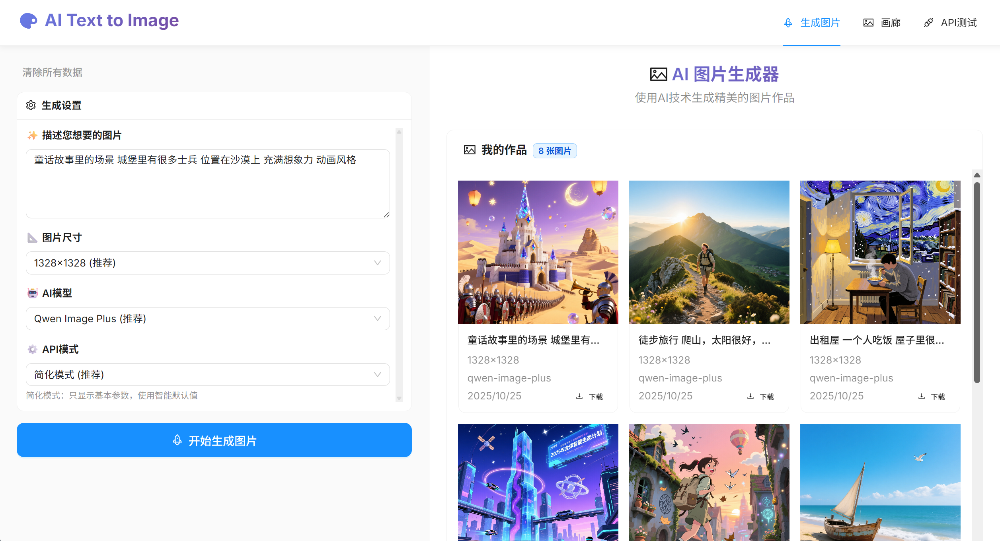

# 🎨 AI 图片生成器

基于 React + TypeScript + Vite 构建的智能图片生成应用，通过文字描述快速生成精美的AI图片。

## ✨ 功能特色

- 🤖 **AI图片生成**：使用阿里云DashScope API，支持多种AI模型
- 🎯 **双模式支持**：简化模式和完整模式，满足不同用户需求
- 📱 **响应式设计**：完美适配桌面端和移动端
- 🖼️ **图片管理**：生成图片自动保存，支持下载和删除
- 📊 **测试工具**：内置API测试功能，支持历史记录查看

## 📸 项目截图

### 主界面 - 图片生成

*简洁直观的图片生成界面，支持多种参数设置*

### 图片画廊

*展示所有生成的图片，支持管理和下载*

### API测试工具

*专业的API测试界面，支持历史记录查看*

### 响应式设计

*完美适配移动设备，随时随地生成图片*


## 🚀 快速开始

### 环境要求

- Node.js >= 16.0.0
- npm >= 8.0.0

### 安装依赖

```bash
npm install
```

### 配置API密钥

1. 复制环境变量模板：
```bash
cp env.example .env
```

2. 编辑 `.env` 文件，添加你的DashScope API密钥：
```env
VITE_DASHSCOPE_API_KEY=sk-your-actual-api-key-here
```

### 启动开发服务器

```bash
npm run dev
```

## 🛠️ 技术栈

- **前端框架**：React 18 + TypeScript
- **构建工具**：Vite
- **UI组件库**：Ant Design
- **状态管理**：React Hooks
- **数据存储**：localStorage + sessionStorage
- **HTTP客户端**：Axios
- **AI服务**：阿里云DashScope API

## 📋 功能详解

### 🎨 图片生成
- **智能提示词**：支持中英文描述，AI智能理解
- **多种尺寸**：支持1:1、16:9、4:3、3:4、9:16等多种比例
- **AI模型选择**：Qwen Image Plus（推荐）和Qwen Image
- **高级参数**：负面提示词、水印控制、智能改写等

### 🖼️ 图片管理
- **自动保存**：生成的图片自动保存到本地
- **批量管理**：支持批量下载和删除
- **数据统计**：显示图片总数和存储统计
- **搜索筛选**：快速找到需要的图片

### 🔧 API测试
- **双模式测试**：简化模式和完整模式API测试
- **历史记录**：所有测试记录自动保存
- **详细日志**：完整的请求和响应数据
- **错误诊断**：详细的错误信息和调试数据


## 📁 项目结构

```
src/
├── api/                 # API服务层
│   ├── client.ts       # HTTP客户端配置
│   └── imageService.ts # 图片生成服务
├── components/         # 公共组件
│   ├── Header.tsx      # 页面头部
│   ├── Footer.tsx      # 页面底部
│   └── Layout.tsx      # 布局组件
├── pages/              # 页面组件
│   ├── Generate.tsx    # 图片生成页面
│   ├── Gallery.tsx    # 图片画廊页面
│   └── APITest.tsx     # API测试页面
├── services/          # 业务服务
│   ├── storageService.ts    # 本地存储服务
│   ├── downloadService.ts   # 下载服务
│   └── sessionService.ts    # 会话服务
├── types/              # 类型定义
└── utils/              # 工具函数
```

## 🔧 开发指南

### 添加新功能

1. 在 `src/pages/` 下创建新页面组件
2. 在 `src/App.tsx` 中添加路由
3. 在 `src/components/Header.tsx` 中添加导航

### API集成

1. 在 `src/api/` 下创建新的API服务
2. 在 `src/types/` 中定义相关类型
3. 在页面组件中调用API服务

### 样式定制

项目使用Ant Design作为UI组件库，支持主题定制：

```typescript
// 在 src/index.css 中自定义样式
.custom-scrollbar {
  scrollbar-width: thin;
  scrollbar-color: #666 #f0f0f0;
}
```

## 🚀 部署指南

### 构建生产版本

```bash
npm run build
```

### 部署到静态托管

构建完成后，将 `dist` 目录部署到任何静态文件服务器：

- **Vercel**：直接连接GitHub仓库自动部署
- **Netlify**：拖拽 `dist` 目录到Netlify
- **GitHub Pages**：使用GitHub Actions自动部署


## 📄 许可证

本项目采用 MIT 许可证 - 查看 [LICENSE](LICENSE) 文件了解详情。

## 🙏 致谢

- [React](https://reactjs.org/) - 用户界面库
- [Ant Design](https://ant.design/) - 企业级UI设计语言
- [Vite](https://vitejs.dev/) - 下一代前端构建工具
- [阿里云DashScope](https://dashscope.aliyun.com/) - AI图像生成服务


⭐ 如果这个项目对你有帮助，请给它一个星标！